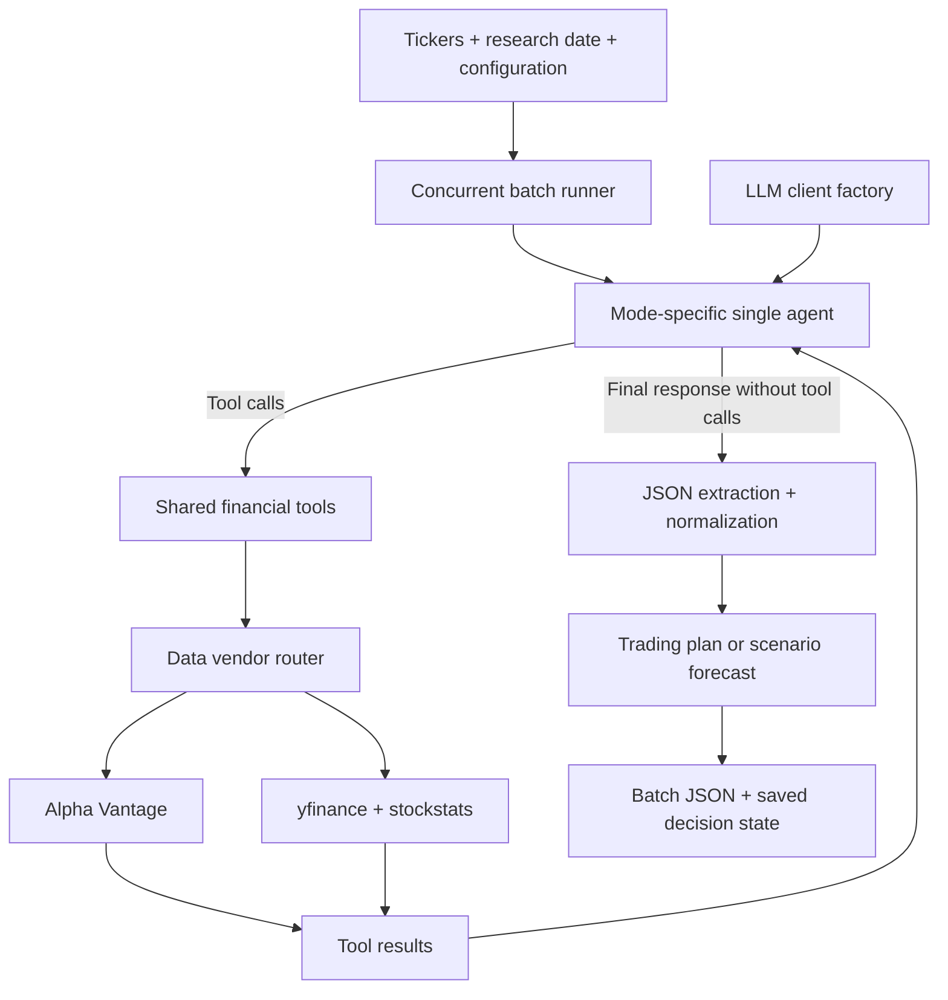

# AFS — Agentic Financial System

**Automated financial research and structured trading decisions with LLM agents.**

AFS turns a ticker list and research date into machine-readable forecasts or trading plans. A single agent gathers evidence through financial data tools, integrates price, technical, fundamental, and news information, and produces a structured result. Independent ticker workflows run concurrently with configurable traces and batch reporting.

Built on [TradingAgents](https://github.com/TauricResearch/TradingAgents), AFS restructures its multi-role analysis and debate workflow into a shared **Agent ↔ Tool Node** loop. The project focuses on repeatable, configurable, and traceable research across multiple stocks, with separate adapters for data vendors and LLM providers.

**Status:** Research prototype. The automated research and decision-generation pipeline is implemented; portfolio simulation, rebalancing, scheduling, and broker execution remain future work. Outputs are for research and education and are not investment advice.

## Why AFS

Stock research combines evidence from sources with different formats, timestamps, coverage, and failure behavior. Repeating that process across a stock universe requires consistent data interfaces, explicit research dates, reusable outputs, and a way to inspect what each agent did.

AFS organizes those concerns into a research pipeline:

**Multi-source data → Agent tool planning → Evidence integration → Forecast or trading decision → Structured JSON → Concurrent batch output**

The main engineering choices are:

| Capability | Design |
| --- | --- |
| Task-driven research | One agent selects evidence through nine shared financial tools |
| Two research modes | Trading plans and short-horizon forecasts use the same graph with different prompts and output contracts |
| Vendor separation | Financial tools route through category-level and tool-level vendor settings |
| Research-date controls | Selected price, indicator, statement, and news paths filter data by the requested date |
| Structured decisions | JSON extraction, field normalization, numeric bounds, and fallback values make output consumable by downstream code |
| Model portability | A client factory isolates provider configuration and response-format differences |
| Batch observability | Independent ticker graphs, worker identifiers, elapsed time, and three trace levels support inspection |

## Architecture



[LangGraph setup](tradingagents/graph/setup.py) creates one mode-specific agent and a shared tool node. Conditional edges return control to the tools while the agent emits `tool_calls`; a response without tool calls ends the workflow, subject to the graph's recursion limit. `AgentState` carries the ticker, date, messages, and decision fields.

Each ticker receives its own graph instance, executed by `ThreadPoolExecutor`. Both modes use the same graph structure and tool set; their prompts and output fields define the research task.

### Research modes

| Mode | Research objective | Output |
| --- | --- | --- |
| `livetrading` | Integrate evidence into a trading plan with stated risk conditions | BUY / SELL / HOLD, confidence, position-size hint, entry and exit conditions, stop-loss, take-profit, risk flags, and rationale |
| `nowcasting` | Update short-horizon market scenarios, targeting 1D / 5D / 20D where evidence allows | Directional view, bull/base/bear probabilities and scenarios, expected volatility, key drivers, watchlist triggers, and limitations |

`livetrading` generates a plan for a downstream execution or paper-trading layer; it does not submit orders. `nowcasting` returns a forecast rather than broker-style trade instructions. Its horizon field describes the requested outlook rather than guaranteeing separate calibrated predictions for each horizon.

### Relationship to TradingAgents

TradingAgents supplies the technical starting point: LangGraph orchestration, financial agent roles, data integrations, and LLM client abstractions. AFS restructures that foundation around batch research, a single-agent dual-mode graph, structured output handling, configurable providers, and execution traces.

Legacy analyst, researcher, trader, and risk modules remain in the package for reference and compatibility. They are not the active multi-stage workflow. The upstream interactive CLI and Docker setup are absent from this public version. Attribution and license terms are preserved in [NOTICE](NOTICE) and [LICENSE](LICENSE).

## Quick start

Requires **Python 3.10 or newer**. Run these commands from the repository root:

```bash
git clone https://github.com/Etlevn/AFS-pub.git
cd AFS-pub
python3 -m venv .venv
source .venv/bin/activate
python -m pip install .
cp .env.example .env
```

On Windows, activate the environment with `.venv\Scripts\activate` instead. This public repository starts from a cleaned snapshot with fresh history on `main`.

Edit `.env` with credentials for your selected LLM provider and data sources. Both `main.py` and `test.py` load it automatically. The file is ignored by Git; keep credentials out of tracked files.

Edit `MAIN_CONFIG` in [config.py](config.py), then run:

```bash
python main.py
```

The public example configuration selects OpenAI, yfinance for all data categories, two sample tickers, two workers, and disabled debug and log output. The analysis date defaults to today. Set `OPENAI_API_KEY` and choose a tool-capable model available to your account before running.

To use Alpha Vantage, change the relevant `data_vendors` entries to `"alpha_vantage"` and set `ALPHA_VANTAGE_API_KEY`. Configure only the providers and data sources your run uses.

## Configuration

`main.py` reads `MAIN_CONFIG` from `config.py`; the legacy name `CONFIG` is also accepted. Select a custom file with `--config path/to/config.py`. Required keys are `tickers`, `max_workers`, `provider`, and `model`.

| Setting | Purpose |
| --- | --- |
| `tickers` | A symbol list or comma-separated string, such as `["AAPL", "MSFT"]` |
| `date` | Analysis date in `YYYY-MM-DD` format; defaults to the local current date if omitted |
| `agent_mode` | `livetrading` or `nowcasting` |
| `max_workers` | Concurrent ticker analyses; the runner uses at least one worker |
| `provider` | LLM provider identifier |
| `model` | Model identifier for the single agent |
| `trace_level` | `basic`, `full`, or `audit` |
| `debug` | Enable graph trace output |
| `log` | Mirror terminal output to `log/<run_id>.log` |
| `data_vendors` | Backend for each market-data category |

Command-line arguments override the corresponding runtime settings in `config.py`. Framework settings start from [DEFAULT_CONFIG](tradingagents/default_config.py), then the runner applies its resolved options. The selected model is assigned to both `quick_think_llm` and `deep_think_llm`; the single agent uses the deep-thinking client. The default output language is English.

For example:

```bash
python main.py \
  --tickers AAPL,MSFT \
  --date 2026-03-31 \
  --agent-mode nowcasting \
  --max-workers 2 \
  --trace-level basic \
  --no-debug \
  --no-log \
  --output-dir output
```

Use `--provider` and `--model` to override the LLM selection, and `--debug` or `--log` to enable those features. Run `python main.py --help` for all arguments. `--max-debate-rounds` is retained as a compatibility setting; the active graph does not run the legacy investment debate.

## LLM providers and credentials

The client factory supports these provider identifiers. Configure only the credentials you need; [.env.example](.env.example) lists all environment variables.

| Provider | Environment variables |
| --- | --- |
| `openai` | `OPENAI_API_KEY` |
| `anthropic` | `ANTHROPIC_API_KEY` |
| `google` | `GOOGLE_API_KEY` |
| `deepseek` | `DEEPSEEK_API_KEY` |
| `xai` | `XAI_API_KEY` |
| `qwen` | `DASHSCOPE_API_KEY` |
| `glm` | `ZHIPU_API_KEY` |
| `openrouter` | `OPENROUTER_API_KEY` |
| `novaiapi` | `NOVAIAPI_API_KEY` |
| `ollama` | No API key; run Ollama at `http://localhost:11434` |
| `azure` | `AZURE_OPENAI_API_KEY`, `AZURE_OPENAI_ENDPOINT`, `AZURE_OPENAI_DEPLOYMENT_NAME`, `OPENAI_API_VERSION` |

Use a model that supports the tool calls required by the workflow. Provider-specific behavior is defined in [tradingagents/llm_clients/](tradingagents/llm_clients/).

## Market data

Set a backend independently for each category in `MAIN_CONFIG["data_vendors"]`:

```python
"data_vendors": {
    "core_stock_apis": "yfinance",
    "technical_indicators": "yfinance",
    "fundamental_data": "yfinance",
    "news_data": "yfinance",
},
```

Supported category backends are `yfinance` and `alpha_vantage`. Alpha Vantage requires `ALPHA_VANTAGE_API_KEY`. Coverage and availability depend on the vendor, instrument, and endpoint.

The [shared tool set](tradingagents/agents/utils/agent_utils.py) exposes nine financial interfaces:

| Tool | Evidence |
| --- | --- |
| `get_stock_data` | Historical price and volume data |
| `get_indicators` | Technical indicators from a supported whitelist |
| `get_fundamentals` | Company overview and fundamental metrics |
| `get_balance_sheet` | Balance sheet |
| `get_cashflow` | Cash flow statement |
| `get_income_statement` | Income statement |
| `get_news` | Company news |
| `get_global_news` | Global and macro news |
| `get_insider_transactions` | Insider transaction information |

The routing path is **financial tool → vendor router → provider implementation**. Framework-level `tool_vendors` overrides category-level `data_vendors`; the batch runner exposes category selection through `MAIN_CONFIG`. To customize tool-level overrides, adjust `DEFAULT_CONFIG` or construct a graph configuration directly.

Agent prompts require stock data before technical indicators, preserve exchange-qualified symbols such as `.TO`, `.L`, and `.HK`, and ask the model to identify missing evidence. The model still chooses tool arguments; prompt instructions are not a hard enforcement layer.

Supported indicator names include `close_50_sma`, `close_200_sma`, `close_10_ema`, `macd`, `macds`, `macdh`, `rsi`, `boll`, `boll_ub`, `boll_lb`, `atr`, and `vwma`. Coverage varies by backend; Alpha Vantage does not directly implement VWMA in this adapter.

Yahoo Finance requests retry rate-limit failures with exponential backoff. The vendor router can try alternatives when `AlphaVantageRateLimitError` propagates, but it does not recover from every failure. Some adapters return error text instead of raising, so fallback is not guaranteed.

## Research dates and point-in-time controls

The research date is carried through graph state, tool arguments, and report fields. AFS includes date-aware filtering to reduce direct use of future observations in historical research. These controls are partial and do not establish a fully point-in-time dataset.

| Data path | Implemented control and boundary |
| --- | --- |
| Historical prices | yfinance requests a date range; Alpha Vantage daily CSV output is filtered to the requested interval |
| Local technical indicators | Cached OHLCV rows are cut off at the research date before stockstats calculates indicators; the raw cache can contain later dates |
| Alpha Vantage indicators | Returned indicator values are selected within the requested lookback window |
| yfinance financial statements | Fiscal periods ending after the research date are removed; period-end dates do not establish when the statements became public |
| News | Company news uses date windows and available publication timestamps; undated articles and limited historical coverage weaken the guarantee |
| Company overview and insider data | Current snapshots are not guaranteed to reconstruct what was known at a historical date |

Alpha Vantage statement filtering currently expects a parsed dictionary, while the request helper returns response text. That path therefore does not reliably apply its fiscal-period filter. Global-news filtering also depends on available timestamps and does not provide a complete historical archive.

Historical-date runs should be treated as exploratory research until disclosure timestamps, revisions, corporate-action adjustments, missing timestamps, and vendor snapshot behavior are validated. Existing filters do not demonstrate freedom from look-ahead bias or establish backtest validity.

## Reports

Each run writes a **JSON array** to `output/<run_id>.json`, or the directory supplied through `--output-dir`. Entries are sorted by ticker. Only successful results containing a structured decision are included. Failed analyses are excluded; the terminal summary reports total, successful, and failed counts. A run with no successful decisions writes an empty array.

These examples illustrate the normalized report shape, not actual market recommendations.

### Trading plan (`livetrading`)

```json
[
  {
    "mode": "livetrading",
    "ticker": "AAPL",
    "date": "2026-03-31",
    "rating": "HOLD",
    "action": "HOLD",
    "confidence": 0.5,
    "position_size_hint": "No new position",
    "entry_condition": "Wait for confirmation with complete data",
    "exit_condition": "Reassess if the research thesis changes",
    "stop_loss": null,
    "take_profit": null,
    "risk_flags": ["Insufficient evidence for a new trade"],
    "data_used": ["Price history", "Company news"],
    "rationale": "Remain on hold until the required evidence is available."
  }
]
```

The agent's raw JSON uses `symbol` and `as_of_date`; the report normalizes them to `ticker` and `date` and adds `rating`. Invalid or missing actions fall back to HOLD, and confidence is clamped to 0–1. JSON extraction and fallback handling do not guarantee that a plan is suitable for execution.

### Scenario forecast (`nowcasting`)

```json
[
  {
    "mode": "nowcasting",
    "symbol": "AAPL",
    "as_of_date": "2026-03-31",
    "forecast_horizon": "1D/5D/20D",
    "directional_view": "neutral",
    "probabilities": {"bull": 0.3, "base": 0.4, "bear": 0.3},
    "expected_volatility": "Moderate",
    "bull_case": "Positive catalysts support an upside move",
    "base_case": "Price remains range-bound without a new catalyst",
    "bear_case": "Negative catalysts drive a downside move",
    "key_drivers": ["Company news", "Market conditions"],
    "watchlist_triggers": ["A confirmed break outside the recent range"],
    "data_used": ["Price history", "Company news"],
    "limitations": ["Forecasts depend on available evidence"]
  }
]
```

Nowcasting reports preserve `symbol` and `as_of_date`. Probabilities are individually clamped to 0–1; the implementation does not normalize their sum. Reports contain the forecast object rather than the internal HOLD wrapper used by the graph.

## Debugging and verification

`--debug` enables graph traces. `basic` shows the latest message, `full` shows all messages, and `audit` includes metadata. `--log` captures stdout and stderr in `log/<run_id>.log`; progress bars stay on the terminal, and the log stream filters progress artifacts. Both `output/` and `log/` are ignored by Git.

The graph also saves selected report and decision state to `<results_dir>/<ticker>/TradingAgentsStrategy_logs/full_states_log_<date>.json`, independently of the terminal `--log` flag. This snapshot is not a complete replay of all messages and tool calls. Repeated runs for the same ticker and date overwrite that path; archive it separately when comparing models or runs.

Framework cache and historical state directories can be overridden with:

- `TRADINGAGENTS_CACHE_DIR` (default: `~/.tradingagents/cache`)
- `TRADINGAGENTS_RESULTS_DIR` (default: `~/.tradingagents/logs`)

For a single-ticker smoke run:

```bash
python test.py
```

`test.py` is a live smoke script, not an isolated unit test. It reuses `config.py` and the batch runner's command-line overrides, analyzes the first configured ticker, and requires LLM credentials. Importing it does not trigger external requests.

## Repository layout

```text
main.py                    Concurrent batch runner and JSON report writer
config.py                  Runtime defaults (MAIN_CONFIG)
test.py                    Live single-ticker smoke script
.env.example               Credential and directory settings template
plan.md                    Proposed daily research and paper-trading pipeline
pyproject.toml             Package metadata and dependencies
uv.lock                    Dependency lockfile
tradingagents/
    agents/                Mode-specific agents, legacy roles, and tools
    graph/                 LangGraph setup, propagation, and signal processing
    dataflows/             Market-data integrations and vendor routing
    llm_clients/           Provider client factory and adapters
    default_config.py      Framework defaults
output/                    Generated batch reports (ignored)
log/                       Captured terminal logs (ignored)
```

## Current scope and roadmap

The current release implements the research-to-decision path. It does not include a research database, portfolio simulator, automated rebalancing, or a broker execution loop. No trading-return, forecast-accuracy, or throughput benchmark is claimed by this repository.

Development priorities are:

1. **Research reliability:** propagate vendor failures consistently, improve fallback and timeout coverage, persist failed ticker results, control audit-log growth, and expand offline tests.
2. **Historical data validity:** enforce disclosure-time and snapshot semantics, validate date constraints across tools, and record data lineage for reproducible research.
3. **Portfolio and automation:** add SQLite research storage, a paper portfolio, target-weight generation, portfolio risk controls, rebalancing, and daily scheduling.

[plan.md](plan.md) contains the proposed daily research and paper-trading pipeline. Its code is illustrative; those pipeline modules are not part of the current runnable application.

## Attribution

This project builds on TradingAgents by TauricResearch. If you use it in research, please acknowledge the upstream project and paper:

```bibtex
@misc{xiao2025tradingagentsmultiagentsllmfinancial,
      title={TradingAgents: Multi-Agents LLM Financial Trading Framework},
      author={Yijia Xiao and Edward Sun and Di Luo and Wei Wang},
      year={2025},
      eprint={2412.20138},
      archivePrefix={arXiv},
      primaryClass={q-fin.TR},
      url={https://arxiv.org/abs/2412.20138},
}
```

## License

Distributed under the [Apache License 2.0](LICENSE). See [NOTICE](NOTICE) for upstream attribution and a summary of modifications.

## Handling credentials and reports

Keep API keys in a local `.env` file and publish only the empty `.env.example` template. Local environment files, logs, reports, databases, and credential files are ignored by Git. Review generated analysis and debug logs before sharing them; model and vendor responses can contain sensitive information.

To report a security issue privately, use the repository's Security tab rather than posting credentials in an issue. See [SECURITY.md](SECURITY.md).

Run the offline credential-redaction regression checks with:

```bash
python -m unittest discover -s tests -v
```
